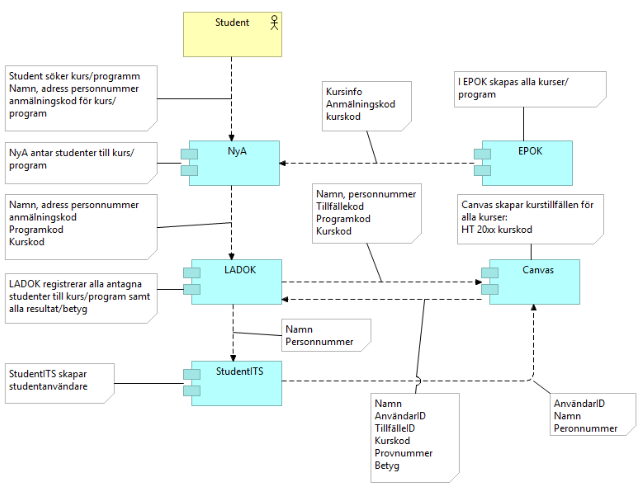
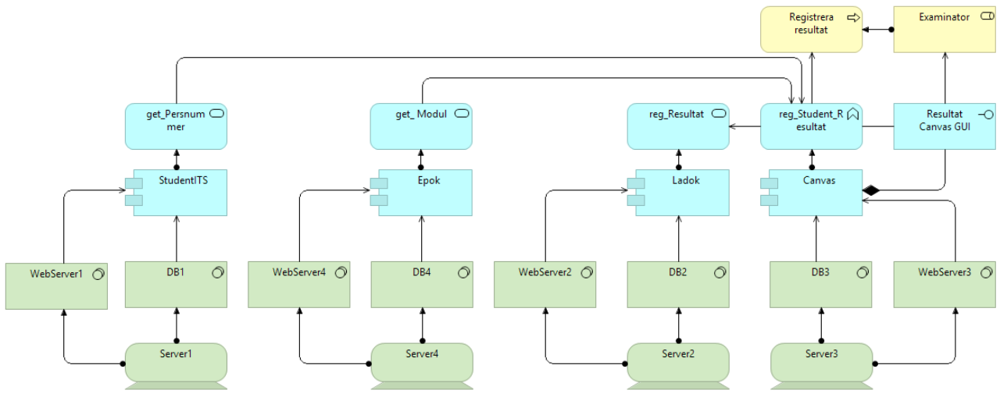

# soa-g2-project

Wrapper repository for multiple git repositories.

This is material produced by Group 2 at LTU for the implementation of SOA web services.


## Getting started
Copy and paste this into a terminal.

HTTPS cloning:
```bash
git clone https://github.com/weleoka/soa-g2-project.git
cd soa-g2-project
git clone https://github.com/weleoka/soa-g2-mock-services.git
git clone https://github.com/weleoka/soa-g2-web-ui.git
git clone https://github.com/weleoka-machine/soa-g2-openapis.git
git clone https://github.com/simonblund/soa-g2-student-service.git
git clone https://github.com/simonblund/soa-g2-examination-service.git
git clone https://github.com/simonblund/soa-g2-app-middleware.git
./build_spring_projects.sh
docker network create g2s-net-1 --subnet 172.24.24.0/24;
docker-compose up --build
echo "Done!"
```

SSH cloning:
```bash
git clone git@github.com:weleoka/soa-g2-project.git
cd soa-g2-project
git clone git@github.com:weleoka/soa-g2-mock-services.git
git clone git@github.com:weleoka/soa-g2-web-ui.git
git clone git@github.com:weleoka-machine/soa-g2-openapis.git
git clone git@github.com:simonblund/soa-g2-student-service.git
git clone git@github.com:simonblund/soa-g2-examination-service.git
git clone git@github.com:simonblund/soa-g2-app-middleware.git
./build_spring_projects.sh
docker network create g2s-net-1 --subnet 172.24.24.0/24;
docker-compose up --build
echo "Done!"
```


## The build process for Spring Boot services/apps
Services can be built using `/soa-g2-xx-service/docker_build.sh`, which is recommended. It can also be done with docker-compose, by uncommenting the relevant build service in `docker_compose.yml`, but then using the command `UID=${UID} GID=${GID} docker-compose up --no-deps student-service-builder`. You may have an issue with UID being a read-only variable in bash. 

To always run the build process with docker-compose and then afterwards starting the JRE container is not practical as the build process takes so long to return.

Todo: currently each project has it's own local copy of the gradle build cache... If would be awesome if that was instead kept in one place as the dependencies between the projects are almost identical.


## Spring Boot services API's
You can find API documentation generated by Swagger at for example: `http://localhost:8085/swagger-ui/index.html` and then `/v3/api-docs` in path input field.


### Networks
Due to some machines running VPN or other docker networks it is safest to create an independent subnet for this project. Before running docker-compose up make sure that the network exists on your host machine, which is what the command `docker network create g2s-net-1 --subnet 172.24.24.0/24` does.


# Developer CI and CD
Some of the repositories use GitHub Actions to build artifacts, run tests etc. See more about the workflows at github here: https://github.com/docker/build-push-action#handle-tags-and-labels


# University systems
This is an overview of the current university systems and approximately how the data is shared between them.



# Target SOA overview



# Ideas for integrations
ArchMate modelling available at [SOA Grupp 2 Archi repository](https://weleoka.github.io/soa-g2-project/)
